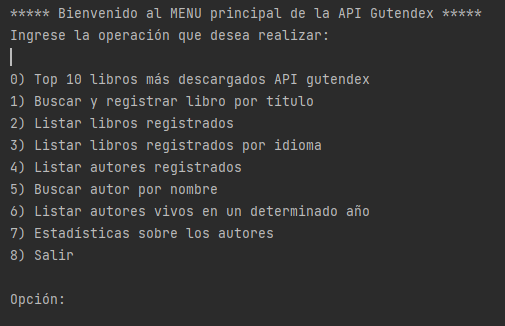

# Challenge de Java y Spring Boot por Alura Latam y Oracle

## Este proyecto integra los siguientes conocimientos:
* Consumo de la API Gutendex para recolectar información sobre libros.
* Spring Boot, JPA, Hibernate.
* Mapeo y relaciones de entidades.
* PostgreSQL como base de datos.
* Uso de derived queries y native queries.
* Uso de Streams, clases lambda, API Collection.

## Sobre la aplicación
El proyecto consiste en crear un gestor de libros para la API Gutendex, permitiendo realizar diversas consultas a la API y registrar datos de libros y de autores a la base de datos de la aplicación.

En la siguiente imagen se logra apreciar el menú principal por consola de la aplicación:

